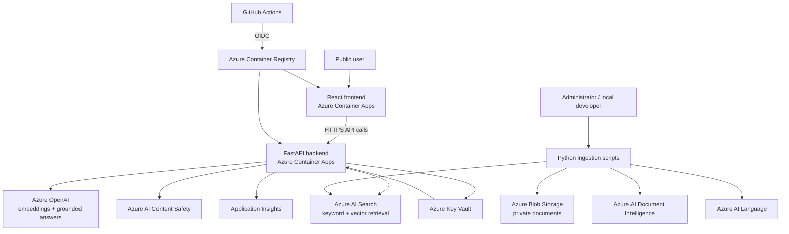
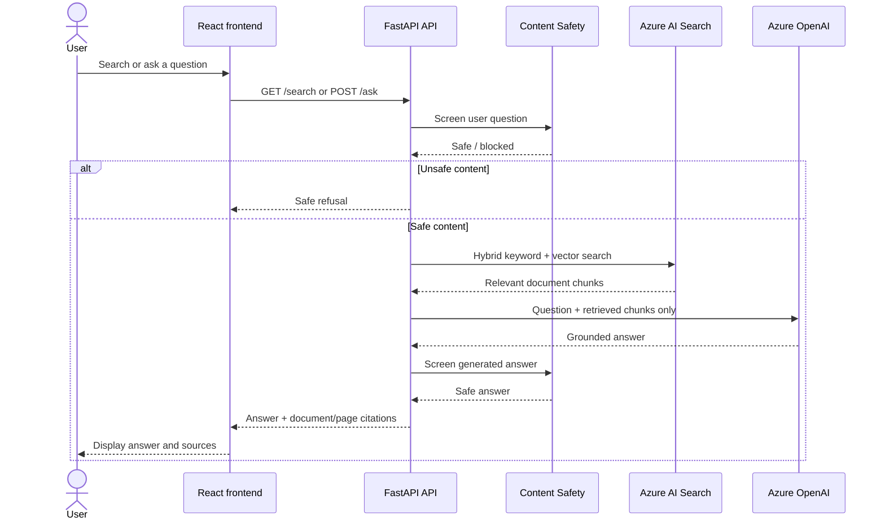
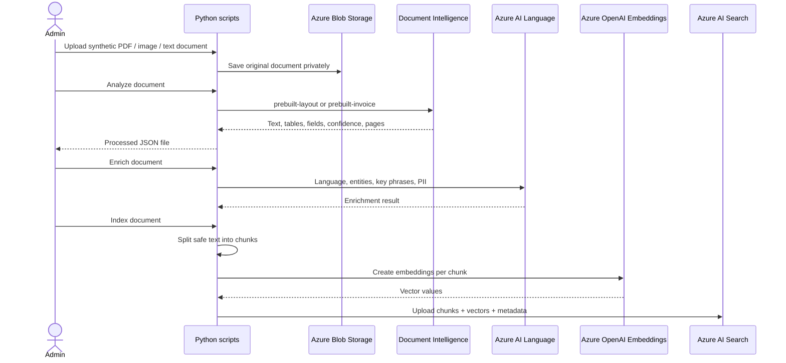
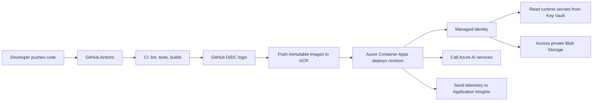

## Live demo

- Public application: https://ca-docintel-web-dev.blackwave-0f15539d.eastus.azurecontainerapps.io
- API documentation: https://ca-docintel-api-dev.blackwave-0f15539d.eastus.azurecontainerapps.io/docs


# Azure Document Intelligence Hub

A public, production-style document assistant built with Azure AI services. It extracts information from synthetic business documents, enriches the extracted text, performs hybrid keyword and vector search, and answers questions with grounded citations.

> This project uses only synthetic sample data. Do not upload company, customer, employee, or personal documents.

## Business problem

Organizations store policies, invoices, and operational documents in formats that are difficult to search and analyze. This project demonstrates an Azure-based solution that:

- Extracts document structure, tables, and invoice fields.
- Detects language, key phrases, entities, and PII.
- Redacts PII before searchable content is stored.
- Supports hybrid keyword and vector search.
- Produces grounded RAG answers with document citations.
- Screens user prompts and generated answers with Azure AI Content Safety.
- Runs locally with Docker and is prepared for GitHub CI/CD.


Think of the project as two separate systems:

1. **Document ingestion pipeline** — administrator processes a document.
2. **Knowledge assistant** — public user searches and asks questions.

## 1. Overall industry architecture




## 2. Public user flow: search and RAG answer



Important: Azure OpenAI does **not** answer from general internet knowledge. It receives only retrieved chunks from your documents. If evidence is missing, it returns the safe fallback response.

## 3. Document ingestion flow

This is administrator-only. Public users cannot upload documents.



## 4. How project files call each other

```text
frontend/src/App.tsx
        |
        v
frontend/src/api.ts
        |
        | HTTP requests
        v
backend/app/main.py
        |
        +--> /documents ----------> app/services/catalog.py
        |
        +--> /search -------------> catalog.py
        |                               |
        |                               v
        |                         azure_search.py
        |
        +--> /ask ----------------> content_safety.py
                                        |
                                        v
                                   catalog.py
                                        |
                                        +--> azure_search.py
                                        |
                                        +--> openai_service.py
                                        |
                                        +--> citations returned
```

## 5. Backend files and their responsibilities

| File | What it does |
|---|---|
| `backend/app/main.py` | Starts FastAPI, defines endpoints, CORS, health check, error handling. |
| `backend/app/config.py` | Reads environment variables safely using Pydantic settings. |
| `backend/app/models.py` | Defines request and response data models. |
| `backend/app/services/catalog.py` | Main business logic: documents, search results, RAG context, citations. |
| `backend/app/services/azure_search.py` | Creates/searches the Azure AI Search index; chunks document text. |
| `backend/app/services/openai_service.py` | Creates embeddings and grounded chat answers using Azure OpenAI. |
| `backend/app/services/content_safety.py` | Screens user prompts and generated answers. |
| `backend/app/services/document_intelligence.py` | Calls Layout and Invoice models; returns structured extraction results. |
| `backend/app/services/language_service.py` | Detects language, entities, phrases, and PII. |
| `backend/app/services/blob_storage.py` | Uploads source documents to Azurite locally or Azure Blob Storage in cloud. |
| `backend/app/telemetry.py` | Sends request, error, and performance telemetry to Application Insights. |

## 6. Script sequence

Run these scripts in this order when adding a new document:

```text
1. upload_document.py
2. analyze_document.py
3. enrich_document.py
4. index_documents.py
5. query_search.py
6. ask_rag.py
7. evaluate_rag.py
```

| Script | Purpose |
|---|---|
| `upload_document.py` | Uploads the original synthetic document to Blob Storage. |
| `analyze_document.py` | Extracts text, tables, invoice fields, pages, and confidence. |
| `enrich_document.py` | Adds Azure AI Language enrichment and privacy information. |
| `index_documents.py` | Chunks text, creates embeddings, and uploads data to AI Search. |
| `query_search.py` | Tests search quality and excerpts. |
| `ask_rag.py` | Tests grounded question-answering from terminal. |
| `evaluate_rag.py` | Runs repeatable RAG evaluation cases. |

## 7. Deployment and security flow



## 8. Tools and why they exist

| Tool | Project role |
|---|---|
| Python | Backend API, ingestion scripts, AI integrations. |
| FastAPI | Public REST API and Swagger documentation. |
| React + TypeScript | Public web interface. |
| Docker | Packages API and frontend consistently. |
| Docker Compose | Runs frontend, API, and Azurite locally. |
| Azurite | Local Azure Blob Storage emulator. |
| Azure Blob Storage | Private cloud source-document storage. |
| Azure AI Document Intelligence | Extracts structured document data. |
| Azure AI Language | Enriches text and supports privacy review. |
| Azure AI Search | Stores searchable chunks and vectors. |
| Azure OpenAI | Creates embeddings and grounded answers. |
| Azure AI Content Safety | Screens unsafe prompts and answers. |
| Key Vault | Stores production service secrets. |
| Managed Identity | Lets Azure services authenticate without passwords. |
| Application Insights | Monitors API performance, errors, and requests. |
| Bicep | Defines Azure infrastructure as code. |
| ACR | Stores Docker images. |
| Container Apps | Hosts the public frontend and API. |
| GitHub Actions | Runs CI and production deployment. |
| GitHub OIDC | Lets GitHub authenticate to Azure without client secrets. |

Your two current documents are simply the safe demonstration dataset. The platform itself is designed to support many policies, invoices, contracts, SOPs, compliance documents, and knowledge-base files.


## Documentation

- [Architecture](docs/architecture.md)
- [Azure setup](docs/azure-setup.md)
- [Operations runbook](docs/runbook.md)
- [Azure AI learning map](docs/learning-map.md)
- [Project milestones](docs/milestones.md)
- [LinkedIn announcement draft](docs/linkedin-announcement.md)
- [Contributing](CONTRIBUTING.md)
